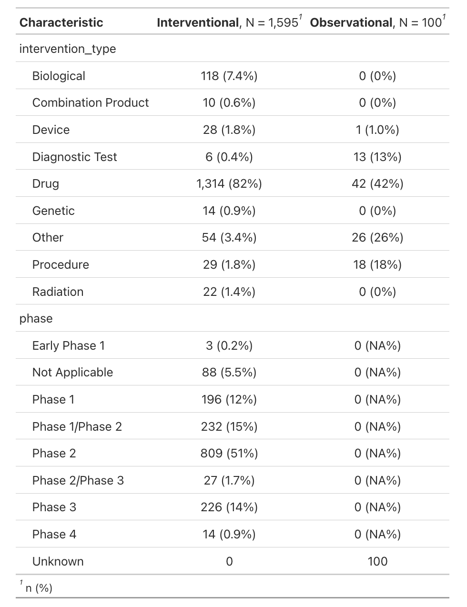
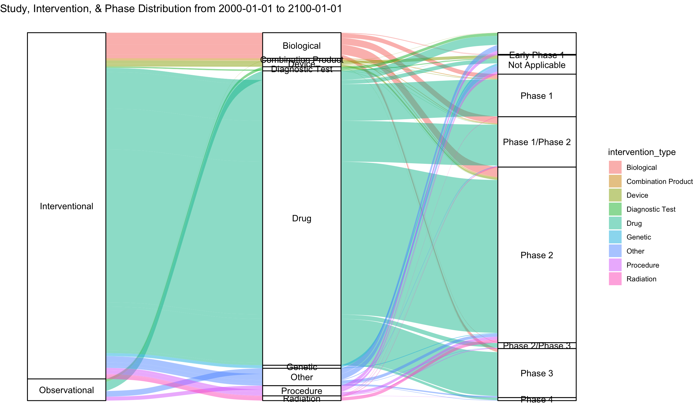
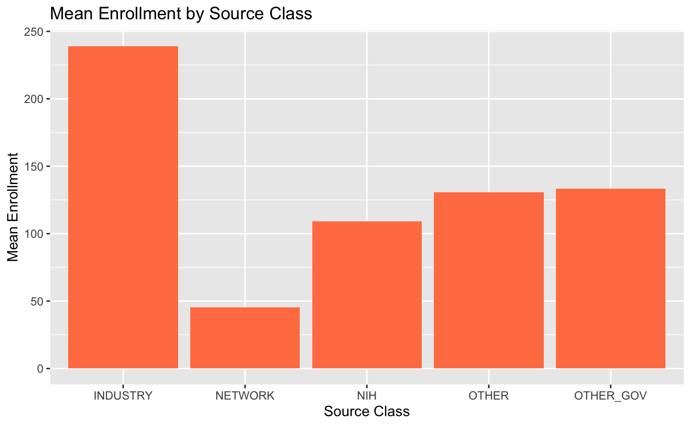
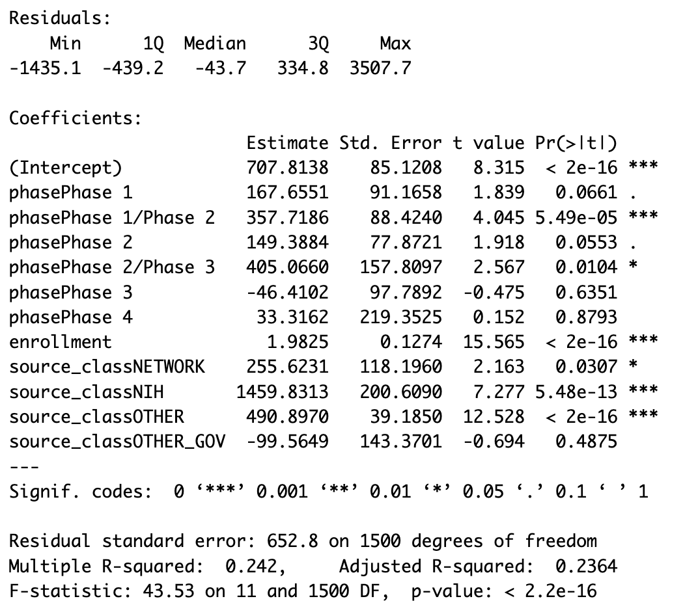

<!-- README.md is generated from README.Rmd. Please edit that file -->

```{r, include = FALSE}
knitr::opts_chunk$set(
  collapse = TRUE,
  comment = "#>",
  fig.path = "man/figures/README-",
  out.width = "100%"
)
```

# bis620.final

<!-- badges: start -->

[](https://github.com/NickyYiningChen/bis620.final/actions/workflows/R-CMD-check.yaml) [](https://github.com/NickyYiningChen/bis620.final/actions/workflows/test-coverage.yaml) [](https://github.com/NickyYiningChen/bis620.final/actions/workflows/R-CMD-check.yaml)

<!-- badges: end -->

The bis620.final project aims to explore the current landscape of clinical studies on metastatic colorectal cancer (mCRC) using clinical trials metadata on clinicaltrials.gov. The package offers off-the-shelf data visualization and statistical analyses tools that allows users to understand characteristics of recent mCRC clinical trials.

## Installation

You can install the development version of bis620.final from [GitHub](https://github.com/) with:

``` r
install.packages("devtools")
install_github("NickyYiningChen/bis620.final")

# Or alternatively:
devtools::install_github("NickyYiningChen/bis620.final")
```

## Example

#### Dataset

The below code block shows you the one of the datasets we are using which consists of information about 717 clinical trials that are related to mCRC:

```{r example1}
library(bis620.final)
crc |> head(5) 
```

Next, this shows the second dataset which contains information about the specific interventions used in the above clinical trials:

```{r example2}
crc_sub |> head(5)
```

#### Data Visualization & Analyses

Here are a few snapshots of implementing the functions of this package:

``` r
summarize_crc_table()
```



``` r
plot_crc_sankey()
```



``` r
plot_intervention_count_time()
```


### Statistical Analyses

``` r
enrollment_source_analysis()
```





``` r
enrollment_phase_analysis()
```


``` r
enrollment_duration_analysis()
```

{width="70%"}


### Regression of Duration

``` r
duration_regression_analysis()
```




### Classification of Overall Status

``` r
status_classification()
```


